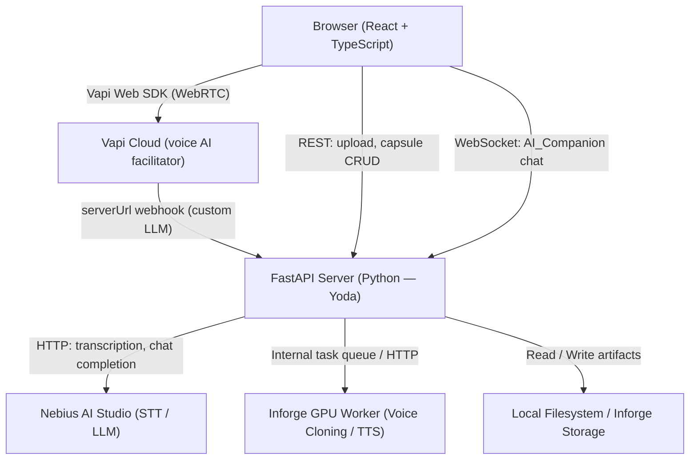
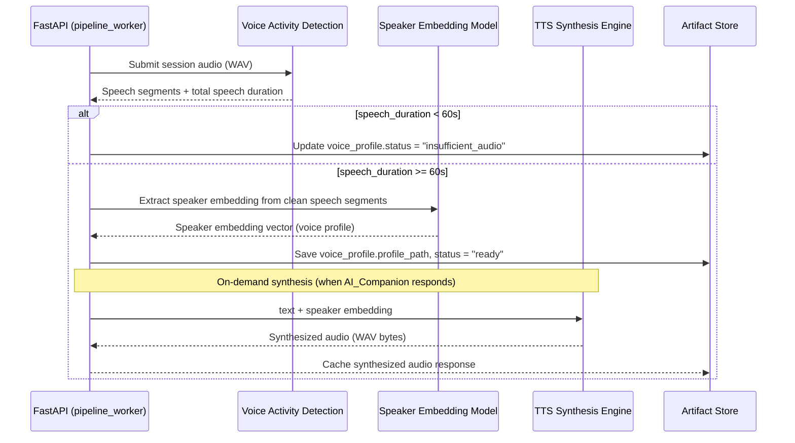

# Design Document: TimeCapsulor

## Overview

TimeCapsulor is an AI-powered time capsule web application that lets users record a meaningful version of themselves via webcam and microphone, guided by an AI facilitator. The resulting capsule is enriched with a Nebius-generated transcript and summary, and can later be revisited and interacted with through an AI companion that responds using the capsule's own context — and optionally speaks back in the user's cloned voice.

**Team split:**
- **Muhammad (frontend)** — React + TypeScript: all UI/UX, webcam/mic recording, Vapi SDK integration in browser.
- **Yoda (backend + ML)** — Python FastAPI: REST + WebSocket API, Nebius inference pipeline (transcription, summarization, LLM), voice cloning via Inforge GPU.

**Hackathon scope (4 hours):** Prioritize a working end-to-end flow. Voice cloning is a stretch/POC. No authentication required.

---

## Architecture

The system is composed of four primary layers communicating over HTTP REST and WebSocket connections.



**Data flow for session creation:**
1. User opens browser → Muhammad's React app loads.
2. User starts session → Vapi SDK activates microphone, streams audio to Vapi Cloud.
3. Vapi Cloud calls the FastAPI `serverUrl` for LLM completions → FastAPI proxies to Nebius LLM.
4. User ends session → browser packages audio + video blobs → POSTs to FastAPI `/session/end`.
5. FastAPI responds immediately with `capsule_id` + `"processing"` status.
6. Background tasks run: Nebius transcription → Nebius summarization → Inforge voice cloning (async, parallel where possible).
7. Frontend polls `GET /capsules/{id}` until status resolves.
8. User opens capsule → WebSocket connects for AI_Companion chat; voice synthesis served as audio endpoint.

---

## Components and Interfaces

### Frontend Components (Muhammad — React/TypeScript)

```
src/
├── pages/
│   ├── HomePage.tsx          # Landing / entry point
│   ├── CreateCapsulePage.tsx # Pre-session setup: permission check, device init
│   ├── SessionPage.tsx       # Active recording + Vapi facilitator UI
│   ├── LibraryPage.tsx       # Capsule list / gallery
│   └── CapsuleViewerPage.tsx # Single capsule view + AI_Companion
├── components/
│   ├── Recorder/
│   │   ├── Recorder.tsx           # MediaRecorder orchestrator
│   │   ├── CameraPreview.tsx      # Live <video> element
│   │   ├── RecordingIndicator.tsx # Pulsing dot + elapsed timer
│   │   └── PermissionGate.tsx     # Request + error UI for camera/mic
│   ├── Facilitator/
│   │   ├── FacilitatorPanel.tsx   # Displays AI prompts as text overlay
│   │   └── VapiController.tsx     # Vapi SDK lifecycle: start/stop/events
│   ├── CapsuleCard.tsx            # Library list item
│   ├── CapsuleViewer/
│   │   ├── VideoPlayer.tsx        # <video> with controls
│   │   ├── TranscriptPanel.tsx    # Scrollable transcript
│   │   ├── SummaryPanel.tsx       # Styled summary with sepia/letter treatment
│   │   └── AiCompanion.tsx        # Chat UI + WebSocket client
│   └── shared/
│       ├── ConfirmationToast.tsx  # Save confirmation message
│       └── StatusBadge.tsx        # Processing / ready / failed indicator
├── hooks/
│   ├── useMediaRecorder.ts   # Wraps MediaRecorder, manages chunks buffer
│   ├── useVapi.ts            # Vapi SDK wrapper (start, stop, events)
│   ├── useUploadWithRetry.ts # Upload logic with 3-retry + download fallback
│   └── useCapsulePolling.ts  # Polls capsule status until resolved
├── services/
│   ├── api.ts                # Typed fetch wrappers for all REST endpoints
│   └── wsCompanion.ts        # WebSocket client for AI_Companion
└── types/
    └── capsule.ts            # Shared TypeScript types (Capsule, ArtifactStatus…)
```

**State management:** React Context + `useReducer` is sufficient for MVP. No Redux or Zustand needed — session state lives in `SessionPage`, capsule list in `LibraryPage`, viewer state in `CapsuleViewerPage`.

**Navigation:** React Router v6 with `<Prompt>` equivalent via `useBeforeUnload` hook during active session.

---

### Backend Services (Yoda — Python FastAPI)

```
backend/
├── main.py                    # FastAPI app, route registration, startup
├── routers/
│   ├── sessions.py            # POST /session/start, POST /session/end
│   ├── capsules.py            # GET /capsules, GET /capsules/{id}
│   └── companion.py           # WebSocket /ws/companion/{capsule_id}
├── services/
│   ├── transcriber.py         # Nebius Whisper STT wrapper
│   ├── summarizer.py          # Nebius LLM summarization prompt
│   ├── voice_cloner.py        # Inforge GPU pipeline: VAD + speaker embedding + TTS
│   └── facilitator_llm.py    # Nebius LLM proxy for Vapi serverUrl
├── workers/
│   └── pipeline_worker.py     # asyncio background task: transcribe → summarize → clone
├── store/
│   ├── capsule_store.py       # CRUD on capsule records (JSON file or SQLite for MVP)
│   └── artifact_store.py      # File I/O for video, audio, profile, audio samples
├── models/
│   └── schemas.py             # Pydantic models: Capsule, ArtifactStatus, CompanionMessage
└── config.py                  # Env vars: NEBIUS_API_KEY, VAPI_PUBLIC_KEY, storage paths
```

**Async design:** FastAPI with `asyncio`. `POST /session/end` spawns `asyncio.create_task(run_pipeline(capsule_id))` immediately before returning the response, so the user never waits on ML processing.

**Vapi serverUrl proxy:** Vapi calls `POST /vapi/llm` on the FastAPI server for each LLM turn. FastAPI forwards to Nebius chat completion API (OpenAI-compatible) with the facilitator system prompt injected and streams the response back.

---

## Data Models

### Capsule Record

```typescript
// TypeScript (frontend shared types — types/capsule.ts)
type ArtifactStatus = "pending" | "processing" | "ready" | "failed" | "insufficient_audio";

interface ArtifactMeta {
  status: ArtifactStatus;
  error?: { code: string; message: string };
}

interface Capsule {
  id: string;                    // UUID v4
  title: string;                 // "Capsule — YYYY-MM-DD" or user-set
  createdAt: string;             // ISO-8601 timestamp
  durationSeconds: number;       // Total recording duration

  // Top-level status resolves once all artifact pipelines finish
  status: "processing" | "ready" | "partial-ready";

  // Artifact locations (relative paths or signed URLs)
  videoUrl: string | null;
  audioUrl: string | null;

  // Per-artifact pipeline results
  transcript: ArtifactMeta & { text?: string };
  summary: ArtifactMeta & {
    narrative?: string;
    themes?: string[];
    keyMemories?: string[];
  };
  voiceProfile: ArtifactMeta & { profilePath?: string };
}
```

```python
# Python (backend — models/schemas.py, Pydantic)
from enum import Enum
from typing import Optional, List
from pydantic import BaseModel
import uuid
from datetime import datetime

class ArtifactStatus(str, Enum):
    PENDING = "pending"
    PROCESSING = "processing"
    READY = "ready"
    FAILED = "failed"
    INSUFFICIENT_AUDIO = "insufficient_audio"

class ArtifactError(BaseModel):
    code: str
    message: str

class ArtifactMeta(BaseModel):
    status: ArtifactStatus = ArtifactStatus.PENDING
    error: Optional[ArtifactError] = None

class TranscriptArtifact(ArtifactMeta):
    text: Optional[str] = None

class SummaryArtifact(ArtifactMeta):
    narrative: Optional[str] = None
    themes: Optional[List[str]] = None
    key_memories: Optional[List[str]] = None

class VoiceProfileArtifact(ArtifactMeta):
    profile_path: Optional[str] = None

class CapsuleStatus(str, Enum):
    PROCESSING = "processing"
    READY = "ready"
    PARTIAL_READY = "partial-ready"

class Capsule(BaseModel):
    id: str = ""
    title: str = ""
    created_at: str = ""
    duration_seconds: float = 0.0
    status: CapsuleStatus = CapsuleStatus.PROCESSING
    video_path: Optional[str] = None
    audio_path: Optional[str] = None
    transcript: TranscriptArtifact = TranscriptArtifact()
    summary: SummaryArtifact = SummaryArtifact()
    voice_profile: VoiceProfileArtifact = VoiceProfileArtifact()
```

**Storage for MVP:** Capsule records are persisted as individual JSON files named `{capsule_id}.json` in a `data/capsules/` directory. Binary artifacts (video, audio, voice profile) are saved in `data/artifacts/{capsule_id}/`. This avoids database setup overhead while remaining sufficient for a single-machine hackathon demo.

---

## API Contracts

### REST Endpoints

#### `POST /session/start`
Validates that the session can be started. For MVP this can return a session token stub.

**Request:**
```json
{ "timestamp": "2025-01-15T10:00:00Z" }
```
**Response `200`:**
```json
{ "session_id": "uuid" }
```

---

#### `POST /session/end`
Accepts multipart upload of video + audio blobs. Immediately creates the capsule record and fires the async pipeline.

**Request:** `multipart/form-data`
- `video`: binary blob (MP4/WebM, max 2 GB)
- `audio`: binary blob (WAV/MP3)
- `duration_seconds`: float
- `title`: string (optional)

**Response `202`:**
```json
{
  "capsule_id": "uuid",
  "status": "processing"
}
```
**Error responses:**
- `413` if upload exceeds 2 GB
- `422` if file format is unsupported

---

#### `GET /capsules`
Returns all capsule records.

**Response `200`:**
```json
[
  {
    "id": "uuid",
    "title": "Capsule — 2025-01-15",
    "created_at": "2025-01-15T10:00:00Z",
    "duration_seconds": 1234,
    "status": "ready"
  }
]
```

---

#### `GET /capsules/{capsule_id}`
Returns full capsule record including artifact details.

**Response `200`:** Full `Capsule` schema (see Data Models).
**Response `404`:** `{ "detail": "Capsule not found" }`

---

#### `GET /capsules/{capsule_id}/artifacts/audio-sample`
Returns a pre-synthesized audio sample for the POC voice demo.

**Response `200`:** `audio/wav` binary stream.

---

#### `POST /vapi/llm`
Vapi calls this as the custom LLM `serverUrl`. FastAPI injects the facilitator system prompt, then proxies to Nebius and streams the response back (SSE / streaming JSON).

**Request:** OpenAI-compatible chat completion request body (sent by Vapi).
**Response:** Streaming OpenAI-compatible chat completion response.

---

### WebSocket: AI_Companion

**Endpoint:** `ws://host/ws/companion/{capsule_id}`

**Client → Server message:**
```json
{ "type": "user_message", "text": "What did I say about my fears?" }
```

**Server → Client messages:**
```json
{ "type": "chunk", "text": "You mentioned" }
{ "type": "chunk", "text": " feeling anxious about..." }
{ "type": "done" }
```

**Error message:**
```json
{ "type": "error", "message": "Capsule not found" }
```

The server streams tokens from a Nebius LLM completion call, chunking into `type: "chunk"` messages and closing with `type: "done"`. The capsule's transcript + summary are prepended as system context. The LLM is instructed to only reference information from the provided context and respond with "I couldn't find that in this capsule" for out-of-context questions.

---

## Voice Cloning Pipeline Flow

The voice cloning pipeline runs entirely on Yoda's local GPU via the Inforge toolchain. It is triggered asynchronously after the session audio is saved, and does not block the user.



**Implementation stack for MVP:**
- **VAD:** `silero-vad` (lightweight, runs on CPU or GPU) for speech detection and duration measurement.
- **Voice cloning / TTS:** XTTS v2 (Coqui TTS) — zero-shot speaker cloning from a reference audio segment. Accepts a WAV reference clip and generates speech in that voice. Runs on CUDA GPU via Inforge.
- **Pre-generated sample (POC fallback):** If the full pipeline isn't ready in 4 hours, a single TTS synthesis call using the session audio as reference is pre-generated during capsule processing and served as the "hear yourself" demo via `GET /capsules/{id}/artifacts/audio-sample`.

**Pipeline steps in `pipeline_worker.py`:**
1. Save video + audio to `data/artifacts/{capsule_id}/`.
2. Fire three concurrent async tasks:
   - `transcribe(capsule_id)` → Nebius Whisper STT
   - `clone_voice(capsule_id)` → local GPU (Inforge)
3. When `transcribe` completes → fire `summarize(capsule_id)` → Nebius LLM.
4. Each step updates the capsule record JSON on completion.
5. After all three root tasks settle → aggregate top-level status to `"ready"` or `"partial-ready"`.

---

## Vapi Integration Approach

Vapi runs entirely in the browser via the official Vapi Web SDK (`@vapi-ai/web`). Muhammad owns this integration.

### How Vapi is initialized

```typescript
// hooks/useVapi.ts (simplified)
import Vapi from "@vapi-ai/web";

const vapi = new Vapi(import.meta.env.VITE_VAPI_PUBLIC_KEY);

vapi.start({
  model: {
    provider: "custom-llm",
    url: `${API_BASE_URL}/vapi/llm`,  // Points to FastAPI proxy → Nebius
  },
  voice: {
    provider: "playht",   // Vapi handles TTS for the facilitator's voice
    voiceId: "jennifer",  // Warm, conversational voice for demo
  },
  firstMessage: "Hi, I'm here to help you create your time capsule...",
  systemPrompt: FACILITATOR_SYSTEM_PROMPT,  // See below
});
```

### Facilitator system prompt

The system prompt is a single string constant defined on the frontend (or served from the backend for easier iteration):

```
You are a warm, empathetic AI facilitator helping the user create a personal time capsule.
Guide them through reflection on five themes in order:
1. Current emotional state
2. Recent accomplishments
3. Current fears or anxieties
4. Goals and hopes
5. A message to their future self

Start with an opening introduction before asking any question.
Ask at least one question per theme. Follow up on specific details the user shares.
If the user is silent for 30 seconds, rephrase or reframe your question — never repeat verbatim.
After all five themes are covered, deliver a warm closing prompt inviting final thoughts.
Keep responses concise (2–3 sentences). Be emotionally warm, curious, and encouraging.
```

### Event handling on the frontend

```
vapi.on("message", (msg) => {
  if (msg.type === "transcript") {
    // Display Vapi's real-time transcript on screen (Requirement 2.5)
    dispatch({ type: "ADD_PROMPT_TEXT", payload: msg.transcript });
  }
});

vapi.on("speech-end", () => {
  // AI_Facilitator finished speaking — UI can update state
});

vapi.on("call-end", () => {
  // Session ended by Vapi — trigger upload flow
});
```

### Prompt display (Requirement 2.5)
Every assistant message arriving via `vapi.on("message")` is rendered as on-screen text in `FacilitatorPanel.tsx` in addition to Vapi's voice delivery. This ensures the user can read and reflect even if audio is unclear.

### Design decision: custom LLM vs Vapi's built-in models
Using `provider: "custom-llm"` with `url` pointing to the FastAPI proxy lets Nebius handle inference while Vapi handles all WebRTC, noise cancellation, turn detection, and TTS. This is the simplest integration for the hackathon: Yoda controls the LLM, Muhammad wires up the SDK.

---

## Nebius Integration

Nebius AI Studio provides an OpenAI-compatible REST API, making it a drop-in replacement for OpenAI calls in the Python backend.

### Transcription (Speech-to-Text)

```python
# services/transcriber.py
from openai import AsyncOpenAI

nebius_client = AsyncOpenAI(
    base_url="https://api.studio.nebius.ai/v1/",
    api_key=settings.NEBIUS_API_KEY
)

async def transcribe_audio(audio_path: str) -> str:
    with open(audio_path, "rb") as f:
        response = await nebius_client.audio.transcriptions.create(
            model="openai/whisper-large-v3",
            file=f,
            response_format="verbose_json",  # includes word-level timing
        )
    return response.text
```

**Model:** `openai/whisper-large-v3` (available on Nebius AI Studio). For a 60-minute session, expect ~30–90 seconds processing time.

### Summarization (LLM)

```python
# services/summarizer.py
SUMMARIZE_PROMPT = """
You are analyzing a transcript from a personal time capsule recording session.
Extract and return a JSON object with:
- "narrative": a 2-3 paragraph narrative summary of the person's reflections
- "themes": list of at least 3 themes discussed
- "key_memories": list of at least 2 direct quotes or specific memories mentioned

Transcript:
{transcript}
"""

async def summarize_transcript(transcript: str) -> dict:
    response = await nebius_client.chat.completions.create(
        model="meta-llama/Meta-Llama-3.1-70B-Instruct",
        messages=[{"role": "user", "content": SUMMARIZE_PROMPT.format(transcript=transcript)}],
        response_format={"type": "json_object"},
    )
    return json.loads(response.choices[0].message.content)
```

### AI_Companion LLM (WebSocket streaming)

```python
# routers/companion.py
COMPANION_SYSTEM = """
You are the AI companion for a personal time capsule. Answer questions using ONLY the 
context below from this person's recording session. If you cannot answer from the context, 
say: "I couldn't find that in this capsule."

Context:
--- TRANSCRIPT ---
{transcript}
--- SUMMARY ---
{summary}
"""

async def stream_companion_response(capsule: Capsule, user_message: str):
    system = COMPANION_SYSTEM.format(
        transcript=capsule.transcript.text,
        summary=capsule.summary.narrative
    )
    stream = await nebius_client.chat.completions.create(
        model="meta-llama/Meta-Llama-3.1-70B-Instruct",
        messages=[
            {"role": "system", "content": system},
            {"role": "user", "content": user_message}
        ],
        stream=True,
    )
    async for chunk in stream:
        yield chunk.choices[0].delta.content or ""
```

---

## Correctness Properties

*A property is a characteristic or behavior that should hold true across all valid executions of a system — essentially, a formal statement about what the system should do. Properties serve as the bridge between human-readable specifications and machine-verifiable correctness guarantees.*

---

**Property Reflection (pre-consolidation analysis):**

From the prework, the following criteria were classified as PROPERTY:
- 2.4 — Conversational context maintained across turns
- 2.5 — Every AI prompt is rendered as on-screen text
- 3.4 — Summarizer output structure (narrative + ≥3 themes + ≥2 memories)
- 3.5 — Capsule record UUID + timestamp invariant (uniqueness)
- 3.8 — Default title format for any creation timestamp
- 4.1 — Library renders title/date/duration for any capsule list
- 4.3 — Artifact status drives content display (ready → show content, pending/failed → show status)
- 4.4 — AI_Companion button visibility follows capsule status
- 5.4 — Voice synthesis produces audio for any text + voice profile
- 5.7 — Voice cloner gate: only attempt if speech >= 60 seconds
- 7.2 — Upload size validation: >2GB → 413
- 7.5 — Pipeline status aggregation: all ready → "ready", any failed → "partial-ready"
- 8.4 — Upload retry: for N failures (N ≤ 3), total attempts = N + 1

**Consolidation decisions:**
- 4.3 and 4.4 both test status-conditional rendering of CapsuleViewer. Consolidate into one property about capsule status driving the full viewer display.
- 2.5 (prompt text display) and 2.4 (context maintained) are distinct behaviors — keep separate.
- 5.7 (gate check) and 5.4 (synthesis produces audio) are distinct pipeline stages — keep separate.
- 3.5 (UUID/timestamp invariant) subsumes the uniqueness angle of capsule creation — keep as a combined invariant property.

---

### Property 1: Conversational context is maintained across turns

*For any* sequence of user messages in a session, each AI_Facilitator follow-up response generated by the LLM should reference at least one subject, name, or phrase that appeared in the prior conversation history — the prompt builder must inject full history into every LLM call.

**Validates: Requirements 2.4**

---

### Property 2: Every AI prompt is rendered as on-screen text

*For any* assistant message string delivered via the Vapi `message` event, the `FacilitatorPanel` component should render that string as visible DOM text, so the user can always read the prompt regardless of audio delivery.

**Validates: Requirements 2.5**

---

### Property 3: Summarizer output satisfies structural invariants

*For any* non-empty transcript text passed to the summarizer, the resulting summary object should always contain: a non-empty `narrative` string, a `themes` array with at least 3 elements, and a `key_memories` array with at least 2 elements.

**Validates: Requirements 3.4**

---

### Property 4: Capsule record creation invariants

*For any* valid session data submitted to `create_capsule()`, the resulting capsule record should have a globally unique UUID (no two calls produce the same ID), a non-null `created_at` timestamp within a few seconds of creation time, and a default title matching the pattern `"Capsule — YYYY-MM-DD"` when no custom title is provided.

**Validates: Requirements 3.5, 3.8**

---

### Property 5: Capsule library renders all required fields

*For any* array of capsule records, the rendered library component should display each capsule's title, creation date, and recording duration for every item in the list, with no missing fields.

**Validates: Requirements 4.1**

---

### Property 6: CapsuleViewer display is driven by artifact status

*For any* capsule record with any combination of artifact statuses, the `CapsuleViewer` should: (a) show artifact content only when that artifact's status is `"ready"`, (b) show a status label ("processing", "failed", etc.) when the status is not `"ready"`, and (c) show the AI_Companion interaction option only when the capsule top-level status is `"ready"`.

**Validates: Requirements 4.3, 4.4**

---

### Property 7: Voice cloner gate enforces minimum speech duration

*For any* audio file, the `should_attempt_voice_clone(audio_path)` function should return `True` if and only if the detected speech duration is at least 60 seconds, and `False` otherwise — the gate must never allow cloning on insufficient audio.

**Validates: Requirements 5.7**

---

### Property 8: Voice synthesis produces audio for any valid text + profile

*For any* non-empty text string and any valid voice profile, calling the `Voice_Synthesizer` should return non-empty audio bytes. If synthesis fails for any reason, the system should still have the text available to fall back to text-only display.

**Validates: Requirements 5.4**

---

### Property 9: Upload size validation

*For any* upload request, the backend should respond with HTTP `413` if and only if the total payload size exceeds 2 GB, and should proceed normally for all payloads at or below that limit.

**Validates: Requirements 7.2**

---

### Property 10: Pipeline status aggregation

*For any* combination of artifact completion states (transcript status, summary status, voice profile status), the top-level capsule status aggregation function should return `"ready"` when all artifacts are `"ready"`, `"partial-ready"` when all are settled (ready or failed) but at least one is `"failed"`, and `"processing"` only while at least one artifact is still pending or processing.

**Validates: Requirements 7.5**

---

### Property 11: Upload retry semantics

*For any* sequence of exactly N consecutive upload failures (0 ≤ N ≤ 3) followed by a success, the `useUploadWithRetry` hook should call the underlying transport function exactly N + 1 times total before resolving successfully. For N > 3 consecutive failures, the hook should call the transport exactly 4 times before giving up and surfacing the download fallback.

**Validates: Requirements 8.4**

---

## Error Handling

### Frontend

| Scenario | Handling |
|---|---|
| Camera/mic permission denied | `PermissionGate` blocks Start button and shows specific error message |
| Device initialization failure | Error message names the failing device; Start blocked |
| Vapi SDK failure to start | Show inline error in `SessionPage`; offer retry |
| Upload failure (1st–3rd attempt) | Auto-retry with 5s delay; show spinner with attempt counter |
| Upload failure (after 3 retries) | Show "Download your recording" button with blob URL |
| Navigation during active session | `beforeunload` dialog requires explicit confirmation |
| Video file unavailable in viewer | Video section shows error; transcript/summary/companion still render |
| AI_Companion WebSocket disconnect | Show reconnect prompt; preserve chat history in component state |
| Capsule status stuck on "processing" | Polling timeout (5 min) triggers "still processing" message |

### Backend

| Scenario | HTTP response / action |
|---|---|
| Upload > 2 GB | `413 Request Entity Too Large` with error body |
| Unsupported file format | `422 Unprocessable Entity`, no capsule created |
| Capsule ID not found | `404 Not Found` with detail message |
| Nebius STT timeout (>120s) | Artifact status → `"pending"`, capsule still saved |
| Nebius STT error | Artifact status → `"failed"`, error code + message recorded |
| Nebius LLM summarization failure | Artifact status → `"failed"`, error recorded |
| Voice cloner GPU OOM or crash | Voice profile status → `"failed"`, capsule saves normally |
| Voice synthesis failure | Log error, return text-only AI_Companion response |
| All pipeline steps settled | Top-level status resolved; never left on `"processing"` indefinitely |

### Hackathon simplifications

- No retry logic on backend pipeline failures (log and mark failed, move on).
- No distributed queue — `asyncio.create_task` is sufficient for a single-process demo.
- No auth tokens — all endpoints are open for MVP demo.
- Voice cloning failure degrades gracefully to text-only without any user-facing crash.

---

## Testing Strategy

### Dual Approach

**Unit + property tests** verify logic correctness. **Integration smoke tests** verify wiring against real services.

### Frontend Testing (Muhammad)

**Framework:** Vitest + React Testing Library.

**Unit/example tests:**
- `PermissionGate`: renders error when `getUserMedia` rejects; disables Start button.
- `CameraPreview`: shows preview when stream is active.
- `RecordingIndicator`: timer increments each second; warning shown at 60 min.
- `useMediaRecorder`: chunks are accumulated in local buffer; recording continues after `visibilitychange`.
- `useUploadWithRetry`: see Property 11 — test retry count logic with mocked fetch.
- `SummaryPanel`: sepia/letter CSS class is present on summary container.
- `AiCompanion`: WebSocket messages appended to chat history; `type: "done"` stops loader.
- `CapsuleCard`: title, date, duration all rendered for any capsule fixture.
- `CapsuleViewerPage`: AI_Companion button absent when status !== "ready".

**Property-based tests** (using [fast-check](https://github.com/dubzzz/fast-check)):

- **Property 2**: `fc.string()` → simulate Vapi message event → assert `FacilitatorPanel` DOM contains the string.
- **Property 5**: `fc.array(fc.record({title: fc.string(), createdAt: fc.string(), durationSeconds: fc.float()}))` → render library → assert each capsule's fields are in the output.
- **Property 6**: `fc.record({status: fc.constantFrom("ready","pending","failed","processing"), transcript: ..., summary: ...})` → render `CapsuleViewerPage` → assert content vs status-label presence follows the rule.
- **Property 11**: `fc.integer({min:0, max:4})` failure count → assert call count matches expected retry semantics.

Minimum 100 iterations per property test (`fc.assert(property, { numRuns: 100 })`).

Tag format for each PBT: comment above the test `// Feature: timecapsulor, Property N: <property text>`

### Backend Testing (Yoda)

**Framework:** pytest + pytest-asyncio + hypothesis.

**Unit/example tests:**
- `test_session_end_returns_202_with_capsule_id`: POST valid multipart → verify 202 + capsule_id.
- `test_session_end_413_on_oversized_upload`: mock oversized content-length → verify 413.
- `test_session_end_422_on_bad_format`: upload `.txt` file → verify 422, no capsule created.
- `test_capsule_not_found_404`: GET non-existent UUID → verify 404.
- `test_pipeline_async_dispatch`: end session → verify background task queued, response returned immediately.
- `test_artifact_failure_marks_failed`: mock Nebius to raise exception → verify artifact status = "failed", capsule saved.
- `test_voice_cloner_skips_on_short_audio`: mock VAD to return 45s → verify status = "insufficient_audio".
- `test_companion_websocket_streams_chunks`: connect WS → send message → verify chunks arrive, done received.
- `test_vapi_proxy_forwards_to_nebius`: POST to `/vapi/llm` → verify Nebius client was called.

**Property-based tests** (using [hypothesis](https://hypothesis.readthedocs.io/)):

- **Property 3** (`test_summarizer_output_invariants`): `st.text(min_size=100)` → call `parse_summary_response()` → assert structure. Tag: `# Feature: timecapsulor, Property 3`
- **Property 4** (`test_capsule_creation_invariants`): `st.fixed_dictionaries({...})` → call `create_capsule()` with mocked store → assert UUID, timestamp, title format. Tag: `# Feature: timecapsulor, Property 4`
- **Property 7** (`test_voice_clone_gate`): `st.floats(min_value=0, max_value=300)` for speech duration → assert `should_attempt_voice_clone(duration)` iff duration >= 60. Tag: `# Feature: timecapsulor, Property 7`
- **Property 9** (`test_upload_size_validation`): `st.integers()` for content-length header → assert 413 iff > 2*1024^3. Tag: `# Feature: timecapsulor, Property 9`
- **Property 10** (`test_pipeline_status_aggregation`): `st.sampled_from(["ready","failed","pending","processing"])` for each of 3 artifact statuses → call `aggregate_capsule_status()` → assert output follows the rule. Tag: `# Feature: timecapsulor, Property 10`

Minimum `@settings(max_examples=100)` on all hypothesis tests.

### Integration / Smoke Tests

- Nebius STT: submit a 10-second WAV fixture → verify non-empty transcript returned.
- Nebius LLM: submit a short transcript fixture → verify summary JSON has required keys.
- Nebius LLM (companion): submit a question + context → verify response is non-empty and < 10s latency.
- Vapi: manual smoke test in browser — session starts, prompts arrive, voice works.
- Voice cloner: manual GPU test on Yoda's machine — submit reference audio, verify profile created.
- Cross-browser: manual smoke on Chrome, Firefox, Edge, Safari.

### Hackathon test priorities (time-boxed)

Given the 4-hour constraint, tests should be written in this order of priority:
1. Backend API contract tests (session end, capsule CRUD, error codes) — unblock Muhammad's frontend work.
2. `useUploadWithRetry` property test — critical resilience logic.
3. Status aggregation property test — critical for capsule state machine.
4. Voice cloner gate unit test — fast to write, important guard condition.
5. UI rendering example tests for Library and CapsuleViewer — validate display logic.
6. Hypothesis property tests for summarizer and capsule creation — stretch if time allows.
